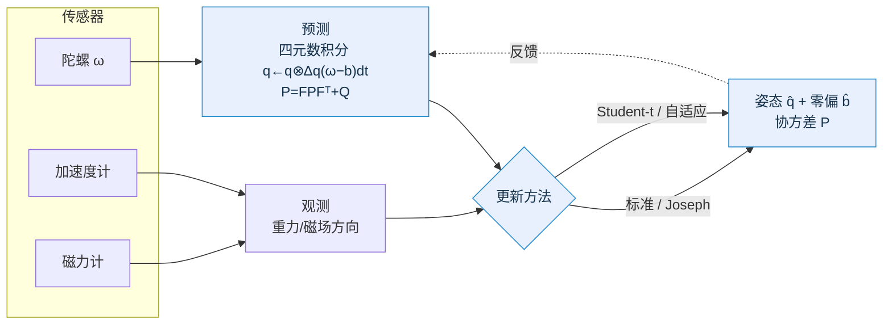

<div align="center">

# 🛰️ 面向模型失配的自适应 EKF 系统

### 第十五届中国软件杯 · A8 四旋翼无人机位姿控制系统设计优化

零动态分配 · 多策略鲁棒/自适应扩展卡尔曼滤波 · 四旋翼姿态估计 · 嵌入式可移植

[](https://github.com/tao903448-dotcom/-EKF/actions/workflows/ci.yml)


</div>

---

## ✨ 项目亮点

- 🎯 **真做四旋翼姿态估计**：7 状态（四元数 + 陀螺零偏）EKF，融合陀螺/加速度计/磁力计，直击 A8 题目核心。
- 🧩 **四种更新策略一套框架**：标准 / Joseph / Student-t / 自适应，可一键切换、同台对比。
- 🛡️ **鲁棒 + 自适应见真章**：振动野值下姿态 RMSE **↓75%**、机动失配下 **↓39%**，并把一致性指标 NIS 从 73 拉回 ≈4。
- 🔬 **严格可复现评测**：多场景 × 20 种子蒙特卡洛，报告 RMSE / 零偏误差 / NIS 一致性，可导出 CSV。
- ⚙️ **嵌入式工程级**：零 `malloc`、alias-safe 矩阵库、可选 ARM NEON（单文件，无重复符号）、四元数约束归一化钩子、数值雅可比。
- ✅ **质量保障**：68 单元/回归测试全过，ASan/UBSan 零报错，`-Wall -Wextra -Werror` 零警告；GitHub Actions 六作业 CI（gcc / clang / 严格告警 / ASan-UBSan / ARM 交叉编译 / cppcheck 静态分析）。

> 本仓库是对原始作品的一次**深度剖析 + 大刀阔斧重构 + 国奖级迭代**。
> 修复了会让标准 EKF 协方差坍缩的致命缺陷、矩阵求逆越界、Student-t 方向写反等问题，
> 并把算法创新落到真实姿态估计问题上、给出诚实可验证的结论。
> 全过程见 [`docs/深度剖析与优化报告.md`](docs/深度剖析与优化报告.md) 与 [`docs/姿态估计实验报告.md`](docs/姿态估计实验报告.md)。

---

## 🧠 系统总览



四旋翼姿态模型作为**通用 EKF 框架的一个配置**接入，因此四种更新方法零成本复用于真实问题。

---

## 🏆 旗舰结果：四旋翼姿态估计

7 状态四元数姿态 EKF，融合陀螺/加速度计/磁力计，200 Hz / 15 s，**20 种子蒙特卡洛**（`make run-attitude` 复现）：

| 场景 | 标准 EKF | Joseph | Student-t | 自适应 |
|---|:--:|:--:|:--:|:--:|
| **CLEAN**（温和+小噪声） | 0.42° · NIS 3.8 ✅ | 0.42° | 0.43° | **0.41°** |
| **OUTLIER**（电机振动野值） | 1.75° · NIS 73 ❌ | 1.75° | 0.44° **↓75%** | **0.42° ↓76%** · NIS 4 ✅ |
| **MANEUVER**（机动比力失配） | 25.7° | 25.7° | 18.6° ↓28% | **15.5° ↓39%** |

> **加速度自适应门控**（按比力幅值偏离 g 降权加速度）进一步压低失配残差：
> MANEUVER 自适应 15.5°→**12.5°**（叠加后相对标准 ↓51%），OUTLIER 标准 1.75°→0.81°，
> CLEAN 不劣化。详见报告 §5.1。
>
> 鲁棒/自适应不仅降低误差，更在野值/失配下**恢复滤波器一致性**（NIS 73→4）。
> `标准 ≡ Joseph`（对最优增益数学等价）佐证实现正确；MANEUVER 残差较大是
> 加速度计在持续线加速度下丢失重力信息的**物理上限**，报告中如实说明。

---

## 🔧 四种更新方法

| 方法 | 核心 | 适用 |
|---|---|---|
| **标准 EKF** | `P=(I−KH)P` | 噪声良好的基线 |
| **Joseph** | `P=(I−KH)P(I−KH)ᵀ+KRKᵀ` | 数值稳定，保对称正定 |
| **Student-t** | 按马氏距离膨胀 `R`（`R·(ν+d²/δ²)/(ν+n)`） | 测量野值/重尾噪声 |
| **自适应** | 按归一化新息平方 NIS 动态调 `R` | 模型失配/噪声时变 |

---

## 🚀 快速开始

```bash
make               # 构建：静态库 + 单元测试 + 两个命令行 demo
make test          # 运行全部 68 个单元/回归测试
make run-attitude  # ⭐ 四旋翼姿态估计：四方法 × 三场景 蒙特卡洛评测
make run-demo      # 1D/2D 四方法诚实双场景对比
make asan          # AddressSanitizer / UBSan 下跑测试
make bench         # 矩阵运算性能基准
make arm_all       # ARM(NEON) 交叉编译（需 arm-linux-gnueabihf 工具链）
```

不用 make 也行（单条 gcc）：

```bash
gcc -I include examples/attitude_demo.c \
    src/quaternion.c src/attitude.c src/matrix.c src/ekf.c -lm -o attitude_demo
./attitude_demo traj.csv     # 运行并导出 roll/pitch/yaw 轨迹 CSV
```

---

## 🗂️ 项目结构

```
.
├── include/            # 公共头文件
│   ├── matrix.h        ekf.h         quaternion.h
│   ├── attitude.h      四旋翼姿态 EKF 模型(7 状态)
│   └── imu_sim.h       可复现 IMU 仿真器(header-only)
├── src/
│   ├── matrix.c        零动态分配 + alias-safe + NEON 内核合一
│   ├── ekf.c           predict/update + 4 种方法 + 归一化钩子
│   ├── quaternion.c    四元数姿态运算
│   └── attitude.c      姿态模型(数值雅可比)
├── tests/              matrix(14) / ekf(41) / attitude(13) + benchmark
├── examples/
│   ├── ekf_demo.c      1D/2D 四方法对比
│   ├── attitude_demo.c 四旋翼姿态估计蒙特卡洛评测
│   └── imgui_demo/     Windows + DX11 + ImGui 图形仪表盘
├── docs/               技术文档 / 深度剖析与优化报告 / 姿态估计实验报告
├── .github/workflows/  ci.yml（gcc/clang/严格/ASan/ARM/cppcheck 六作业）
└── Makefile
```

---

## 🧩 API 速览

```c
#include "attitude.h"      /* 四旋翼姿态 EKF */
#include "ekf.h"

EKF_Config cfg;  attitude_config_init(&cfg);     /* 7 状态/6 观测 + 回调全挂好 */
ekf_set_process_noise(&cfg, &Q);
ekf_set_measurement_noise(&cfg, &R);
ekf_set_update_method(&cfg, EKF_UPDATE_ADAPTIVE);

EKF_State st;  ekf_state_init(&st, &cfg, &x0, &P0);
for (int k = 0; k < N; k++) {
    ekf_predict(&st, &cfg, &gyro, dt);           /* 陀螺预测 */
    ekf_update (&st, &cfg, &meas);               /* 加速度计+磁力计更新 */
}
```

> 矩阵运算 **alias-safe**：`matrix_mul(&P, &A, &P)` 这类 result 与输入同址的写法结果正确
> （修复前会先清零再读取，是协方差坍缩的根因）。

---

## ✅ 测试与持续集成

| 套件 | 结果 | 覆盖 |
|---|:--:|---|
| `test_matrix` | 14 / 14 | 别名安全、求逆越界、NaN守卫、步长视图、Cholesky解 |
| `test_ekf` | 41 / 41 | 协方差不坍缩、Standard≡Joseph、抗野值、预测不混叠、枚举守卫 |
| `test_attitude` | 13 / 13 | 四元数运算、姿态精度/一致性、鲁棒性、加速度门控回归 |

GitHub Actions 六作业：**gcc 构建+测试** · **clang 构建** · **严格告警(-Werror)** · **ASan/UBSan** · **ARM(NEON) 交叉编译** · **cppcheck 静态分析**。

---

## 🗺️ 路线图

- [x] 修复致命缺陷（协方差坍缩 / 求逆越界 / Student-t 方向 / NEON 构建）
- [x] 仓库规范化（去 zip、标准布局、.gitignore）
- [x] 四旋翼姿态估计 EKF + 严格蒙特卡洛评测 + CI
- [ ] 乘性误差状态 EKF（MEKF）对照实现
- [x] 加速度幅值门控（已完成；运动模型融合待续，进一步压低机动失配残差）
- [ ] 真实数据集（如 EuRoC）回放验证

---

## 📚 文档

- [深度剖析与优化报告](docs/深度剖析与优化报告.md) —— 缺陷定位、根因、重构与实证
- [姿态估计实验报告](docs/姿态估计实验报告.md) —— 建模、实验设置、结果与诚实结论
- [技术文档](docs/技术文档.md) —— 框架与 API 说明
- [快速开始](GETTING_STARTED.md)

---

## 📄 许可证

本项目仅供学习与中国软件杯比赛使用。

<div align="center">

**版本 3.0.0** · 2026-06-21 · 软件杯团队

</div>
