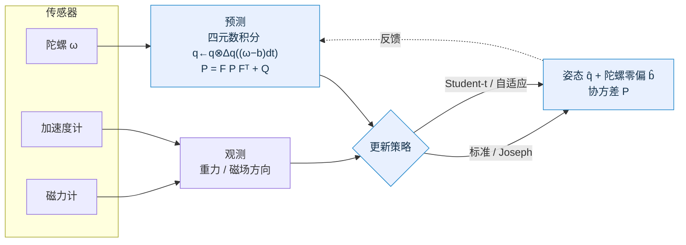

<div align="center">

# 🛰️ 面向模型失配的自适应 EKF 系统

### 第十五届中国软件杯 · A8 四旋翼无人机位姿控制系统设计优化

零动态分配 · 多策略鲁棒/自适应扩展卡尔曼滤波 · 四旋翼姿态估计 · 嵌入式可移植

[](https://github.com/tao903448-dotcom/-EKF/actions/workflows/ci.yml)


</div>

---

## 项目简介

四旋翼无人机的姿态估计长期受两类干扰困扰：**电机振动**给加速度计带来脉冲野值，
**大机动**使加速度计的比力偏离重力方向（模型失配）。固定噪声的标准卡尔曼滤波在
这两种工况下会过度信任被污染的观测，导致姿态发散、协方差失真。

本项目针对该问题，构建了一套**零动态分配、可在嵌入式实时系统运行的扩展卡尔曼
滤波（EKF）框架**，并在统一框架内实现并对比四种更新策略——标准、Joseph、
Student-t 鲁棒、自适应——使其能按噪声特性"对症"抑制野值与模型失配。框架之上落地
了**四旋翼姿态估计**应用（四元数 + 陀螺零偏，融合陀螺/加速度计/磁力计），并以
多场景蒙特卡洛给出可复现、可度量的性能与一致性结论。

---

## ✨ 核心特性

- 🎯 **四旋翼姿态估计**：7 状态（姿态四元数 + 陀螺零偏）EKF，陀螺预测 + 加速度计/磁力计更新，四元数无万向锁、适合大机动。
- 🧩 **四策略一套框架**：标准 / Joseph / Student-t / 自适应一键切换、同台对比；姿态模型作为框架的一个配置接入，更新策略零成本复用。
- 🛡️ **鲁棒 + 自适应**：振动野值下姿态 RMSE 较标准 EKF **降低 79%**，机动失配下**降低 70%**（自适应 + 加速度门控），并将新息一致性指标 NIS 由 73 拉回 ≈4。
- 🔬 **严格可复现评测**：多场景 × 多种子蒙特卡洛，报告姿态 RMSE / 零偏误差 / NIS 一致性与越界比例，关键参数经多核蒙特卡洛网格寻优确定。
- ⚙️ **嵌入式工程级**：零 `malloc`，定长矩阵；alias-safe 矩阵运算；可选 ARM NEON（与标量同处一份源文件，无重复符号）；带约束状态归一化钩子；Cholesky 解 + 数值雅可比。
- ✅ **质量保障**：85 单元/回归测试全过，ASan/UBSan 零报错，`-Wall -Wextra -Werror` 零警告；GitHub Actions 六作业 CI。

---

## 🧠 系统架构



---

## 📐 算法原理

**状态** `x = [q (4), b (3)]`：姿态四元数（body→world, Hamilton）+ 陀螺零偏。

**预测**（陀螺驱动）：

```
q_k = q_{k-1} ⊗ Δq((ω_m − b)·dt)        # 四元数积分，每步重归一化
P_k = F P_{k-1} Fᵀ + Q                   # F 在先验状态处线性化（数值雅可比）
```

**更新**（加速度计 + 磁力计，方向型观测 `h(x)=[Rᵀĝ_w ; Rᵀm̂_w]`）：

```
S = H P Hᵀ + R                           # 新息协方差（Cholesky 解，免显式求逆）
K = P Hᵀ S⁻¹                             # 卡尔曼增益
x ← x ⊞ K (z − h(x)) ;  P ← (I−KH) P     # 状态/协方差更新 + 对称化
```

> 加速度计在持续线加速度（机动）下，其"重力方向"会偏离真值，构成天然的**模型失配**；
> Student-t 与自适应更新据马氏距离 / 归一化新息平方对此类观测自动降权，是本项目应对失配的核心。

---

## 🏆 性能评测：四旋翼姿态估计

7 状态四元数姿态 EKF，融合陀螺/加速度计/磁力计，200 Hz / 15 s，**20 种子蒙特卡洛**（`make run-attitude` 复现）：

| 场景 | 标准 EKF | Joseph | Student-t | 自适应 |
|---|:--:|:--:|:--:|:--:|
| **CLEAN**（温和 + 小噪声） | 0.42° · NIS 3.8 | 0.42° | 0.36° | **0.41°** |
| **OUTLIER**（电机振动野值） | 1.75° · NIS 73 | 1.75° | **0.37° ↓79%** | 0.42° ↓76% · NIS 4 |
| **MANEUVER**（机动比力失配） | 25.7° | 25.7° | 11.8° ↓54% | 13.8° ↓46% |

**加速度自适应门控**（按比力幅值偏离 g 的程度降权加速度，参数经 64 核蒙特卡洛寻优）进一步压低失配残差：MANEUVER 自适应 13.8°→**7.67°**（相对标准 EKF **↓70%**），OUTLIER 标准 1.75°→0.68°，而 CLEAN 不劣化——门控/自适应"按需触发"，良性工况近乎无代价。

要点：鲁棒/自适应不仅降低误差，更在野值/失配下**恢复滤波器一致性**（NIS 73→4）；
`标准 ≡ Joseph`（对最优增益数学等价）可作为实现正确性自检；MANEUVER 残差源于
加速度计在持续线加速度下丢失重力信息的物理上限，需运动模型/外部定位进一步改善。

---

## 🔧 四种更新策略

| 策略 | 协方差 / 噪声处理 | 适用工况 |
|---|---|---|
| **标准 EKF** | `P=(I−KH)P` | 噪声良好的基线 |
| **Joseph** | `P=(I−KH)P(I−KH)ᵀ+KRKᵀ` | 数值稳定，保持对称正定 |
| **Student-t** | 按马氏距离膨胀 `R`：`R·(ν+d²/δ²)/(ν+n)` | 测量野值 / 重尾噪声 |
| **自适应** | 按归一化新息平方 NIS 动态调 `R` | 模型失配 / 噪声时变 |

---

## 🚀 快速开始

```bash
make               # 构建：静态库 + 单元测试 + 命令行 demo
make test          # 运行全部 85 个单元/回归测试
make run-attitude  # ⭐ 四旋翼姿态估计：四策略 × 三场景 蒙特卡洛评测
make run-demo      # 1D/2D 四策略对比演示
make sweep         # OpenMP 多核参数寻优（建议多核服务器）
make asan          # AddressSanitizer / UBSan 下跑测试
make arm_all       # ARM(NEON) 交叉编译（需 arm-linux-gnueabihf 工具链）
```

不用 make 也行（单条 gcc）：

```bash
gcc -I include examples/attitude_demo.c \
    src/quaternion.c src/attitude.c src/matrix.c src/ekf.c -lm -o attitude_demo
./attitude_demo traj.csv     # 运行并导出 roll/pitch/yaw 轨迹 CSV
python3 tools/plot_attitude.py traj.csv   # 绘制对比图（需 matplotlib）
```

---

## 🧩 API 速览

```c
#include "attitude.h"      /* 四旋翼姿态 EKF */
#include "ekf.h"

EKF_Config cfg;  attitude_config_init(&cfg);     /* 7 状态/6 观测，回调全部挂好 */
ekf_set_process_noise(&cfg, &Q);
ekf_set_measurement_noise(&cfg, &R);
ekf_set_update_method(&cfg, EKF_UPDATE_ADAPTIVE);

EKF_State st;  ekf_state_init(&st, &cfg, &x0, &P0);
for (int k = 0; k < N; k++) {
    ekf_predict(&st, &cfg, &gyro, dt);           /* 陀螺预测 */
    ekf_update (&st, &cfg, &meas);               /* 加速度计 + 磁力计更新 */
}
```

> 矩阵运算 **alias-safe**：支持 `matrix_mul(&P, &A, &P)` 这类 result 与输入同址（原地）写法，结果正确——协方差递推等场景可直接复用同一缓冲。

---

## 🗂️ 项目结构

```
.
├── include/            # 公共头文件
│   ├── matrix.h        ekf.h         quaternion.h
│   ├── attitude.h      四旋翼姿态 EKF 模型(7 状态)
│   └── imu_sim.h       可复现 IMU 仿真器(header-only)
├── src/
│   ├── matrix.c        零动态分配 + alias-safe + NEON 内核合一
│   ├── ekf.c           predict/update + 4 种更新策略 + 归一化钩子
│   ├── quaternion.c    四元数姿态运算
│   └── attitude.c      姿态模型(数值雅可比)
├── tests/              matrix(17) / ekf(51) / attitude(17) + benchmark
├── examples/
│   ├── ekf_demo.c      1D/2D 四策略对比
│   ├── attitude_demo.c 四旋翼姿态估计蒙特卡洛评测
│   ├── param_sweep.c   OpenMP 多核参数寻优
│   └── imgui_demo/     Windows + DX11 + ImGui 图形仪表盘
├── tools/              plot_attitude.py（轨迹/误差绘图）
├── docs/               技术文档 / 姿态估计实验报告
├── .github/workflows/  ci.yml（gcc/clang/严格/ASan/ARM/cppcheck 六作业）
└── Makefile
```

---

## ✅ 测试与持续集成

| 套件 | 结果 | 覆盖 |
|---|:--:|---|
| `test_matrix` | 17 / 17 | 基本运算、求逆/分解、别名安全、大维求逆、NaN 守卫、步长视图、Cholesky 解 |
| `test_ekf` | 51 / 51 | 预测/更新全流程、协方差正定、Standard≡Joseph、抗野值、双精度参考滤波对照 |
| `test_attitude` | 17 / 17 | 四元数运算、姿态精度与 NIS 一致性、鲁棒性、加速度门控 |

GitHub Actions 六作业：**gcc 构建+测试** · **clang 构建** · **严格告警(-Werror)** · **ASan/UBSan** · **ARM(NEON) 交叉编译** · **cppcheck 静态分析**。代码行覆盖率约 79%。

---

## 🗺️ 路线图

- [x] 四旋翼姿态估计 EKF（四元数 + 陀螺零偏，IMU 融合）
- [x] 四种鲁棒/自适应更新 + 加速度自适应门控
- [x] 多场景蒙特卡洛评测 + 64 核参数寻优 + 六作业 CI
- [ ] 乘性误差状态 EKF（MEKF）对照实现
- [ ] 过程噪声 Q 在线自适应、运动模型融合
- [ ] 真实数据集（EuRoC / TUM-VI）回放验证
- [ ] 跨平台图形界面

---

## 📚 文档

- [姿态估计实验报告](docs/姿态估计实验报告.md) —— 建模、实验设置、结果与一致性分析
- [技术文档](docs/技术文档.md) —— 框架设计与 API 说明
- [快速开始](GETTING_STARTED.md) —— 环境、构建与运行

---

## 📄 许可证

本项目仅供学习与中国软件杯比赛使用，详见 [LICENSE](LICENSE)。

<div align="center">

**版本 3.2.0** · 2026-06-21 · 软件杯团队

</div>
